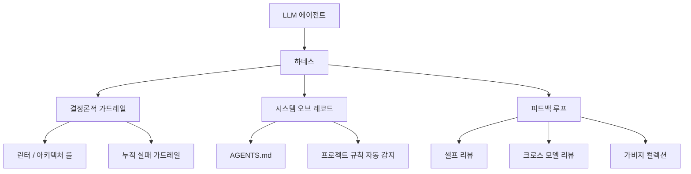
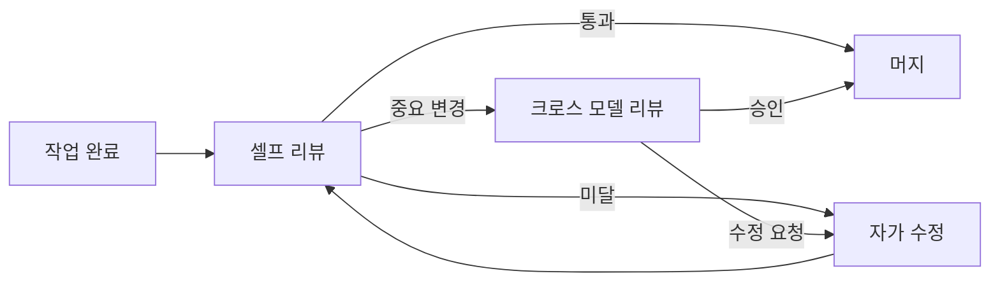
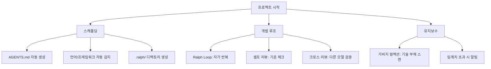

## 목차

- [왜 하네스가 필요한가](#왜-하네스가-필요한가)
- [하네스의 세 가지 기둥](#하네스의-세-가지-기둥)
- [업계는 어떻게 하고 있나](#업계는-어떻게-하고-있나)
- [내가 적용한 방법](#내가-적용한-방법)
- [가장 중요한 교훈](#가장-중요한-교훈)
- [영감받은 오픈소스](#영감받은-오픈소스)

## 왜 하네스가 필요한가

LLM 에이전트를 쓰다 보면 알게 되는 게 있다. 모델이 똑똑한 건 당연한 전제지, 실제 결과물의 품질은 에이전트를 어떻게 감싸느냐에 달려있다는 것.

쉽게 비유하자면, LLM이 뇌라면 하네스는 몸통과 손발이다. 뇌가 아무리 똑똑해도 몸이 제 역할을 하지 않으면 결과물은 엉망이 된다. 프롬프트를 아무리 다듬어도 세션이 바뀌면 비슷한 실수를 반복하고, 긴 작업을 시키면 갈수록 코드가 누적돼서 엉망이 된다.

기획을 하면서 늘 하던 생각이 있다. **문제를 정의하지 않고 해결책을 논하면 안 된다.** 에이전트의 문제는 모델이 아니라 환경에 있다는 걸 깨달았을 때, 비로소 진짜 해결책을 찾기 시작했다.

## 하네스의 세 가지 기둥

하네스가 뭔지 한 다이어그램으로 정리하면 이렇다.

하나씩 쉽게 풀어보겠다.

### 결정론적 가드레일

에이전트가 마음대로 아키텍처를 바꾸거나, 존재하지 않는 API를 호출하거나, 위험한 코드를 작성하지 못하도록 막는 장치다. 린터, 구조적 테스트, 아키텍처 룰이 여기에 해당한다.

이게 중요한 이유는, 에이전트가 한 번 저지른 실수가 다음 세션에서도 반복되기 때문이다. 인간 개발자라면 "아, 지난번에 이거 하다가 망쳤지"하고 기억하지만, 에이전트는 세션이 끝나면 기억이 날아간다.

Terraform과 Ghostty를 만든 Mitchell Hashimoto가 [자신의 블로그](https://mitchellh.com/writing/my-ai-adoption-journey#step-5-engineer-the-harness)에서 이렇게 정리했다.

> "에이전트가 실패하면, 에이전트를 고치지 마라. 환경을 고쳐라."

그가 제안한 **"누적 실패 가드레일"**은, 에이전트가 한 번 실패한 경험을 규칙으로 변환해서 다음 세션에서는 원천 차단하는 방식이다. 에이전트가 학습하는 게 아니라, 하네스가 학습하는 것이다.

### 시스템 오브 레코드

프로젝트 루트에 `AGENTS.md` 파일을 두어, 에이전트가 반드시 따라야 할 규칙과 빌드 절차, 과거 실패에서 배운 교훈을 기록한다. 에이전트가 매 세션 시작 시 이 파일을 읽게 되는데, 사실상 에이전트용 컨벤션 문서다.

기획할 때도 프로젝트 시작하면 온보딩 문서를 만들잖아. 에이전트도 마찬가지다. "이 프로젝트는 이런 규칙을 따른다"는 걸 명확하게 적어두면, 에이전트가 매번 처음부터 배우지 않아도 된다.

### 피드백 루프

에이전트가 자신의 작업을 스스로 검증하고, 필요하면 다른 에이전트에게 리뷰를 요청하는 구조다.

에이전트가 "다 했어요"라고 말하는 순간 끝나는 게 아니라, 일련의 검증 파이프라인을 거쳐야 작업이 완료된 것으로 간주된다. 회사에서 코드 리뷰 없이 배포하지 않는 것과 같은 원리다.

## 업계는 어떻게 하고 있나

이게 내가 혼자 고민한 문제가 아니라는 걸 확인하고 싶었다. 리서치해보니 OpenAI, Anthropic, Hashimoto, Martin Fowler 모두 비슷한 결론에 도달해 있었다.

### OpenAI: 100만 줄을 직접 타이핑 없이

[OpenAI가 발표한 하네스 엔지니어링 글](https://openai.com/index/harness-engineering/)은 내게 가장 큰 영감을 줬다. Codex 에이전트를 활용해 100만 줄 이상의 코드베이스를 **직접 타이핑한 코드 없이** 구축한 실험 결과다.

핵심은 에이전트에게 "무엇을 해야 하는지"만 지시하고, "어떻게 할지"는 하네스가 제어하는 방식이었다. 아키텍처 룰, 커스텀 린터, 구조적 테스트, 옵저버빌리티 파이프라인을 에이전트 주변에 배치해서, 에이전트가 자유롭게 움직이되 허용된 범위 안에서만 움직이게 만들었다.

특히 인상 깊었던 건 **가비지 컬렉션** 개념이었다. 에이전트가 만든 코드는 인간이 짠 코드와 다르게 부패하는 패턴이 다르다. 인간은 점진적으로 리팩토링하지만, 에이전트는 누적된 컨텍스트 속에서 점점 더 복잡한 해결책을 시도하다가 코드를 뒤엎어버린다. OpenAI는 이걸 감지하고 정리하는 전용 에이전트를 하네스에 포함시켰다.

### Anthropic: 여러 세션을 하나의 흐름으로

[Anthropic의 엔지니어링 블로그](https://www.anthropic.com/engineering/effective-harnesses-for-long-running-agents)에서는 조금 다른 각도로 접근했다. 문제는 긴 작업을 여러 세션에 걸쳐 진행할 때, 컨텍스트가 끊기면 에이전트가 이전에 뭘 했는지 잊어버린다는 점이었다.

Anthropic의 해결책은 에이전트를 두 가지로 나누는 것이었다. **이니셜라이저 에이전트**가 첫 세션에서 환경을 설정하고 진행 상황 파일을 남긴다. 이후 세션의 **코딩 에이전트**가 그 파일을 읽고 이어서 작업한다. 한 번의 컨텍스트로 끝나지 않는 작업을 여러 세션에 걸쳐 일관되게 진행하는 방식이다.

### Hashimoto와 Fowler의 관점

[Mitchell Hashimoto](https://mitchellh.com/writing/my-ai-adoption-journey)는 AI 도입 여정을 6단계로 나누고, 마지막 단계가 바로 "하네스 엔지니어링"이었다. 에이전트가 한 번 저지른 실수를 규칙으로 변환해서 다음 세션에서 차단하는 방식을 제안했다.

[Martin Fowler](https://martinfowler.com/articles/exploring-gen-ai/harness-engineering.html)는 하네스가 미래에 "새로운 서비스 템플릿"이 될 수 있다고 봤다. 커스텀 린터, 구조적 테스트, 컨텍스트 문서를 포함한 하네스가 코드베이스 설계 패턴의 새로운 추상화 계층이 될 수 있다는 관점이다.

## 내가 적용한 방법

이런 자료들을 참고해서, 내 Hermes Agent에 어떻게 적용했는지 정리한다. 기획할 때처럼, 먼저 전체 구조를 보고 각 부분을 설명하겠다.

### 프로젝트 스캐폴딩: 시작이 반이다

새 프로젝트를 시작할 때마다 `AGENTS.md`, `.hermes.md`, `.ralph/` 디렉토리를 자동 생성하는 스킬을 만들었다. `detect_project.py`가 프로젝트 구조를 분석해서 언어, 프레임워크, 빌드 명령어를 자동 감지하고, 그에 맞는 규칙을 `AGENTS.md`에 써넣는다.

이건 Anthropic이 말한 이니셜라이저 에이전트와 비슷한 역할이다. 프로젝트 초기에 환경을 제대로 설정해두면, 이후 모든 세션에서 에이전트가 일관된 컨텍스트로 시작할 수 있다.

### 가비지 컬렉션: 엔트로피와 싸우기

OpenAI의 가비지 컬렉션 개념을 빌려와서, 에이전트가 생성한 코드에서 누적되는 기술 부채를 주기적으로 스캔하는 스킬을 만들었다.

실제로 에이전트가 여러 세션에 걸쳐 코드를 수정하다 보면, 중복된 유틸리티 함수나 사용하지 않는 임포트가 누적되는 걸 자주 봤다. 인간 개발자라면 PR 리뷰에서 걸러내겠지만, 에이전트는 스스로 그걸 인지하지 못한다. 전용 스캐너가 필요하다는 걸 직접 겪으면서 깨달았다.

### Ralph Loop: 셀프 리뷰와 크로스 리뷰

[obra/superpowers](https://github.com/obra/superpowers) 프레임워크에서 영감받아, 에이전트가 작업 완료 후 자동으로 품질 검증 루프를 도는 스킬 세트를 만들었다.

`ralph-loop`는 에이전트가 작업 후 자가 반복 수정을 하고, `ralph-self-review`는 기준 체크리스트에 맞춰 스스로 리뷰하고, `ralph-cross-review`는 중요한 변경을 다른 모델에게 크로스 리뷰를 요청한다. 모든 검증을 통과해야만 머지가 허용된다.

superpowers의 TDD 강제 패턴도 참고했다. 테스트를 먼저 작성하게 하고, 테스트가 실패하는 걸 확인한 다음, 최소한의 코드로 테스트를 통과하게 만드는 방식이다. 기획에서 "요구사항 정의 → 설계 → 구현 → 검증"의 흐름을 따르는 것과 같은 원리다.

## 가장 중요한 교훈

하네스 엔지니어링을 직접 적용하면서 가장 크게 느낀 것을 세 가지로 정리한다.

**스킬은 만들고 안 쓰면 의미가 없다.** 115개의 스킬을 만들고, 감사하고, 고치고, 포팅하는 데 며칠을 썼다. 하지만 정작 실제 작업할 때 그 스킬들을 로드하지 않았다. `using-superpowers`라는 메타 스킬에 "적용 가능한 스킬이 1%라도 있으면 반드시 로드하라"는 규칙을 적어놓고도 스스로 안 지켰다. 에이전트의 행동을 변화시키는 것은 스킬의 내용이 아니라, 그 스킬을 실제로 로드하고 따르는지에 달려있다.

**빌드가 성공해도 배포가 되는 건 아니다.** 실제로 `next-mdx-remote` 취약점(CVE-2026-0969) 때문에 Vercel이 배포를 차단한 사례를 겪었다. 빌드 로그는 "Compiled successfully"였는데, 배포 로그 끝에 보안 경고가 숨어있었다. 기획할 때도 "QA 통과 != 출시 가능"인 것처럼, 빌드뿐만 아니라 배포 로그 끝까지 확인하는 습관이 필요하다.

**에이전트 코드는 인간 코드와 다르게 부패한다.** 인간은 점진적으로 리팩토링하지만, 에이전트는 누적된 컨텍스트 속에서 점점 더 복잡한 해결책을 시도하다가 코드를 뒤엎어버린다. 이건 에이전트의 버그가 아니라 에이전트의 특성이니, 그에 맞는 관리 방식(가비지 컬렉션)이 필요하다.

## 영감받은 오픈소스

이 글을 쓰면서 참고하고, 직접 에이전트에 적용해본 프로젝트들이다.

**[obra/superpowers](https://github.com/obra/superpowers)** - 코딩 에이전트를 위한 구성 가능한 스킬 프레임워크. TDD 강제, 설계 흐름(브레인스토밍 → 스펙 → 구현 플랜 → 실행), 서브에이전트 기반 코드 리뷰, git worktree 관리를 제공한다. Hermes Agent의 Ralph Loop와 하네스 스킬 세트를 포팅할 때 이 구조를 많이 참고했다.

**[OpenAI Codex](https://github.com/openai/codex)** - OpenAI의 오픈소스 코딩 에이전트. 하네스 엔지니어링의 실제 구현 사례를 볼 수 있다. 아키텍처 제약, 옵저버빌리티, 가비지 컬렉션의 구현 방식이 참고됐다.

**[Claude Code](https://github.com/anthropics/claude-code)** - Anthropic의 CLI 코딩 에이전트. 여러 세션에 걸친 작업 관리, 이니셜라이저 에이전트 패턴 등을 참고했다.

에이전트가 자율적으로 일하게 하려면, 그 자율성을 안전하게 담아내는 그릇이 필요하다. 그 그릇을 설계하는 것이 하네스 엔지니어링이고, 그 그릇을 만드는 건 결국 우리의 몫이다.
