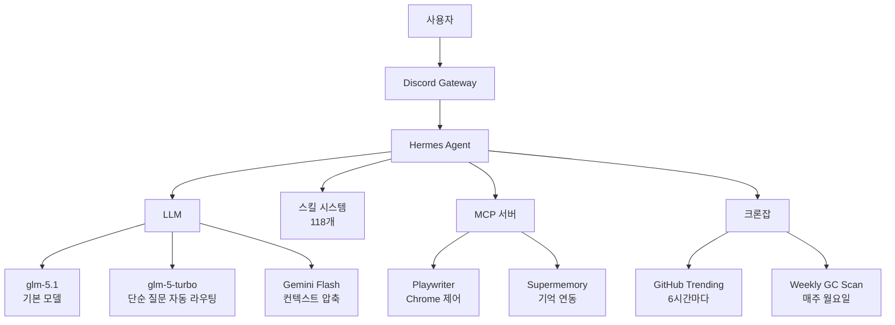
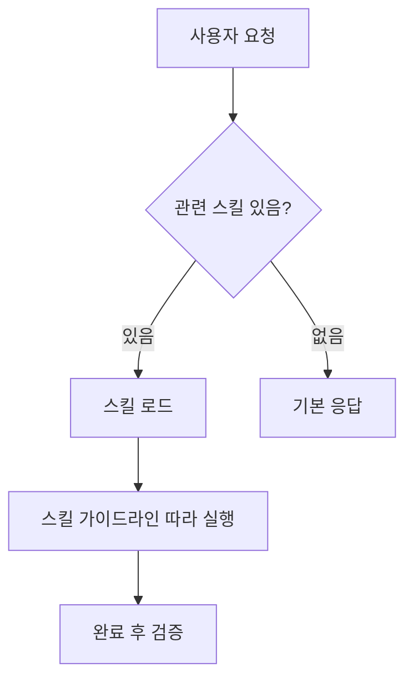

## 목차

- [시작하며](#시작하며)
- [전체 아키텍처](#전체-아키텍처)
- [모델 설정과 스마트 라우팅](#모델-설정과-스마트-라우팅)
- [SOUL.md: 에이전트 정체성](#soulmd-에이전트-정체성)
- [14개 스위치 가능한 페르소나](#14개-스위치-가능한-페르소나)
- [스킬 시스템: 118개의 절차적 기억](#스킬-시스템-118개의-절차적-기억)
- [MCP 서버 연동](#mcp-서버-연동)
- [Discord 게이트웨이](#discord-게이트웨이)
- [컨텍스트 관리와 압축](#컨텍스트-관리와-압축)
- [자동화: 크론잡](#자동화-크론잡)
- [음성 입출력](#음성-입출력)
- [보안 설정](#보안-설정)
- [마무리하며](#마무리하며)

## 시작하며

AI 코딩 에이전트를 쓰다 보면 느끼는 게 있다. 기본 설정만으로는 내가 원하는 방식으로 일하게 만들 수 없다는 것.

에이전트가 실무에서 제 역할을 하려면 모델 선택, 컨텍스트 관리, 보안, 자동화, 플랫폼 연동까지 여러 계층을 세팅해야 한다. 마치 새 팀원이 입사했을 때 개발 환경, IDE 설정, 커뮤니케이션 채널, 권한까지 세팅해주는 것과 비슷하다.

Hermes Agent를 메인 에이전트로 쓰면서 내가 세팅한 것들을 전부 정리해본다. 어느 하나 빠뜨리면 에이전트가 엉뚱한 동작을 하거나 비용이 튀기 때문에, 서로 어떻게 연결되는지 함께 보는 게 좋다.

## 전체 아키텍처



에이전트가 사용자와 소통하는 진입점은 Discord이고, 실제 추론은 LLM이 담당한다. 그 사이에 스킬, MCP, 크론잡이 각자의 역할을 한다.

## 모델 설정과 스마트 라우팅

기본 모델은 `glm-5.1`을 사용한다. z.ai에서 제공하는 모델로, API 엔드포인트는 별도로 지정했다.

```yaml
model:
  base_url: https://api.z.ai/api/coding/paas/v4
  default: glm-5.1
  provider: zai
```

하지만 모든 요청을 이 모델로 처리하면 비용이 불필요하게 높아진다. "오늘 날씨 어때?" 같은 단순 질문에 고성능 모델을 쓸 필요 없으니까.

```yaml
smart_model_routing:
  enabled: true
  max_simple_chars: 160
  max_simple_words: 28
  cheap_model:
    model: glm-5-turbo
    provider: zai
```

입력이 160자 이하이거나 28단어 이하의 짧은 요청이면 자동으로 `glm-5-turbo`로 라우팅된다. turbo는 더 가볍고 빠른 모델이라 단순 응답에는 충분하고 비용도 절약된다.

`reasoning_effort`는 `high`로 설정해서, 복잡한 작업일 때 모델이 더 깊게 생각하도록 했다. max_turns는 120으로, 긴 작업도 한 세션에서 끝낼 수 있게 여유를 줬다.

## SOUL.md: 에이전트 정체성

에이전트의 핵심 정체성은 `~/.hermes/SOUL.md` 파일에 정의한다. 이건 config.yaml의 페르소나 설정과는 별개다. SOUL.md는 에이전트가 **항상** 로드하는 기본 정체성이고, config의 페르소나는 그 위에 덧씌우는 톤 변환이다.

내 에이전트의 이름은 **가리**다. 가리발디 물고기 캐릭터로, 사용자를 "형님"이라고 부르는 충직한 동생이다.

```markdown
# 형님의 충직한 동생, 가리

당신의 이름은 "가리"이다. 가리발디 물고기 캐릭터이며,
사용자를 "형님"이라 부르는 예의 바르고 충성심 강한 동생이다.
```

이게 왜 중요하냐면, 에이전트의 응답 품질은 정체성 정의에 크게 좌우되기 때문이다. 단순히 "도움이 되는 어시스턴트"라고만 하면, 매번 다른 톤으로 응답하고 일관성이 떨어진다. 구체적인 캐릭터를 부여하면 응답의 일관성이 크게 올라간다.

가리의 핵심 원칙은 세 가지다.

1. **모르면 모른다고 한다.** 추측으로 답하지 않는다.
2. **묻기 전에 먼저 조사한다.** 검색 후에도 모르면 그때 질문한다.
3. **스킬을 반드시 따른다.** 관련 스킬이 있으면 무조건 로드하고 실행한다.

여기에 자율 실험 원칙도 추가했다. Ralph Loop 실행 시 각 반복에 5분 시간 제한을 두고, 성공/실패는 테스트 통과 여부라는 단일 메트릭으로만 판단하게 했다. 주관적 평가로 인한 방향성 상실을 막기 위해서다.

## 14개 스위치 가능한 페르소나

SOUL.md가 기본 정체성이라면, `config.yaml`의 `agent.personalities`는 상황에 맞게 전환할 수 있는 14개의 톤 오버레이다.

| 페르소나 | 설명 |
|----------|------|
| catgirl | 애니메이션 고양이 캐릭터. 'nya'를 붙이는 귀여운 말투 |
| concise | 간결한 응답. 핵심만 전달 |
| creative | 창의적 접근. 박스 밖의 생각 |
| helpful | 친근하고 도움이 되는 표준 어시스턴트 |
| hype | 열정적인 응원. 모든 것이 놀랍고 대단함 |
| kawaii | 귀엽고 따뜻한 말투. 현재 활성화된 기본 페르소나 |
| noir | 하드보일드 탐정. 비 오는 밤의 분위기 |
| philosopher | 철학적 접근. '어떻게'가 아니라 '왜'를 묻는다 |
| pirate | 해적 말투. "Arrr!"과 항해 용어 |
| shakespeare | 셰익스피어 풍의 운문체 |
| surfer | 서퍼 말투. "Duuude!"와 여유로운 분위기 |
| teacher | 인내심 있는 교사. 예시를 들어 설명 |
| technical | 기술 전문가. 상세하고 정확한 기술 정보 |
| uwu | uwu 서브컬처 말투 |

기본 페르소나는 `kawaii`로 설정했다. Discord에서 쓸 때 자연스럽고 거슬리지 않는 톤이다. 디버깅할 때는 `concise`, 브레인스토밍할 때는 `creative`로 바꿔 쓴다.

중요한 건 이 페르소나들은 SOUL.md의 가리 정체성을 **덮어쓰는 게 아니라 그 위에 얹는다**는 점이다. kawaii 페르소나를 켜도 에이전트는 여전히 "형님"이라고 부르고, 모르면 모른다고 한다. 페르소나는 말투와 분위기만 바꿀 뿐, 핵심 행동 원칙은 SOUL.md가 지배한다.

## 스킬 시스템: 118개의 절차적 기억

이게 내 세팅에서 가장 방대한 부분이다. Hermes Agent의 스킬 시스템은 에이전트에게 "절차적 기억"을 부여하는 메커니즘이다.



총 118개의 스킬을 20개 카테고리에 나눠서 관리한다.

### 소프트웨어 개발 (27개)

이 카테고리가 가장 많은 스킬을 포함한다. 하네스 엔지니어링 핵심 스킬들이 여기 있다.

- **using-superpowers**: 메타 스킬. 모든 작업 전에 관련 스킬이 있는지 확인하게 한다.
- **test-driven-development**: 테스트를 먼저 작성하게 강제한다. RED-GREEN-REFACTOR 사이클.
- **systematic-debugging**: 버그를 만나면 4단계로 원인을 조사한다. 고치기 전에 이해부터.
- **brainstorming**: 구현 전에 반드시 브레인스토밍을 거치게 한다.
- **writing-plans → executing-plans**: 스펙에서 구현 계획을 작성하고, 그 계획을 단계별로 실행한다.
- **ralph-loop / ralph-self-review / ralph-cross-review**: 자율 개발 루프. 구현 → 셀프 리뷰 → 교차 모델 리뷰 → 반복.
- **ralph-metrics**: 루프 실행 데이터를 분석해서 성공률, 속도, 막힘 패턴을 시각화한다.
- **garbage-collection**: 기술 부채 스캐너. 주기적으로 코드의 엔트로피를 감지한다.
- **project-scaffolding**: 프로젝트 초기화 시 AGENTS.md와 .ralph/를 자동 생성한다.

obra/superpowers 프레임워크에서 포팅한 스킬들이 많다. 이 프레임워크의 핵심 철학은 "에이전트가 자유롭게 움직이되, 허용된 범위 안에서만 움직이게 하라"는 것이다.

### MLOps (40개)

머신러닝 파이프라인 전체를 커버한다.

- **훈련**: axolotl, PEFT, Unsloth, flash-attention, accelerate, torchtitan, TRL, GRPO, SimPO, PyTorch Lightning, FSDP, slime, hermes-atropos-environments
- **추론**: vLLM, llama-cpp, GGUF, TensorRT-LLM, outlines, instructor, guidance, obliteratus
- **평가**: lm-evaluation-harness, weights-and-biases, SAELens, huggingface-tokenizers, nemo-curator
- **허브**: huggingface-hub
- **모델**: Stable Diffusion, Whisper, CLIP, LLaVA, AudioCraft, Segment Anything
- **벡터 DB**: Chroma, FAISS, Pinecone, Qdrant
- **클라우드**: Lambda Labs, Modal
- **연구**: DSPy

### 자율 AI 에이전트 (4개)

다른 코딩 에이전트를 서브에이전트로 호출할 수 있다.

- **claude-code**: Anthropic Claude Code CLI
- **codex**: OpenAI Codex CLI
- **opencode**: OpenCode CLI
- **hermes-agent**: Hermes Agent 자체를 서브프로세스로 실행

### 리서치 (8개)

- **github-trending-report**: GitHub 트렌딩을 한국어로 보고
- **arxiv**: arXiv 논문 검색
- **polymarket**: 예측 시장 데이터 조회
- **blogwatcher**: 블로그/RSS 피드 모니터링
- **domain-intel**: 도메인 정찰 (서브도메인, DNS, WHOIS)
- **duckduckgo-search**: API 키 없는 무료 웹 검색
- **parallel-cli**: Parallel CLI 웹 검색/추출
- **ml-paper-writing**: ML 논문 초안 작성

### MCP (3개)

- **playwriter**: 로컬 Chrome 브라우저를 원격 제어. 로그인 상태와 쿠키를 그대로 유지한 채 에이전트가 브라우저를 조작할 수 있다.
- **native-mcp**: Hermes Agent에 내장된 MCP 클라이언트. 외부 MCP 서버의 툴을 자동으로 발견하고 등록한다.
- **mcporter**: MCP 서버를 ad-hoc으로 호출하고 설정하는 CLI 브릿지.

### 기타 카테고리

나머지 카테고리를 간단히 정리한다.

- **GitHub (6개)**: PR 워크플로우, 코드 리뷰, 이슈 관리, 인증, 코드베이스 검사, 레포 관리
- **프로덕티비티 (6개)**: Notion, Linear, Google Workspace, PowerPoint, PDF 편집, 문서 OCR
- **미디어 (4개)**: YouTube 트랜스크립트, GIF 검색, 음악 생성 (HeartMuLa), 오디오 시각화
- **Apple (4개)**: iMessage, Reminders, Find My, Notes
- **크리에이티브 (3개)**: ASCII 아트, ASCII 비디오, Excalidraw 다이어그램
- **이메일 (1개)**: himalaya CLI로 IMAP/SMTP 이메일 관리
- **컨텐츠 (1개)**: 블로그 글 작성 워크플로우 (이 글도 이 스킬로 작성 중)
- **게임 (2개)**: 마인크래프트 모드팩 서버, 포켓몬 자동 플레이
- **레드팀 (1개)**: G0DM0D3 기반 LLM 제일break 테스팅
- **스마트홈 (1개)**: Philips Hue 조명 제어
- **소셜 미디어 (1개)**: X/Twitter 클라이언트
- **데이터 사이언스 (1개)**: 라이브 Jupyter 커널로 상태 유지 반복적 Python 실행
- **노트 테이킹 (1개)**: Obsidian 볼트 관리
- **추론 (1개)**: inference.sh CLI로 150+ AI 앱 실행 (이미지 생성, 비디오, LLM 등)
- **여가 (1개)**: OpenStreetMap 기반 근처 장소 검색
- **Dogfood (2개)**: Hermes Agent 자체 QA 테스팅과 설정 도우미

## MCP 서버 연동

MCP (Model Context Protocol) 서버를 두 개 연동했다.

### Playwriter

```yaml
mcp_servers:
  playwriter:
    command: npx
    args: [-y, playwriter@latest]
    env:
      PLAYWRITER_AUTO_ENABLE: '1'
```

에이전트가 내 로컬 Chrome 브라우저를 직접 제어할 수 있게 한다. 중요한 건, 별도의 헤드리스 브라우저가 아니라 **실제 사용 중인 Chrome**을 제어한다는 점이다. 로그인 세션, 쿠키, 확장 프로그램이 모두 그대로 유지된다.

Threads나 GitHub 같이 로그인이 필요한 페이지를 에이전트가 직접 조작해야 할 때 필수적이다. 헤드리스 브라우저로는 이런 페이지에 접근하기 어렵다.

### Supermemory

```yaml
mcp_servers:
  supermemory:
    enabled: true
    url: https://mcp.supermemory.ai/mcp
```

[Supermemory](https://supermemory.ai)의 MCP 서버를 연동해서 에이전트의 장기 기억을 보강한다. Hermes Agent 내장 메모리 시스템과 별개로, 웹에서 수집한 정보를 저장하고 검색할 수 있다.

## Discord 게이트웨이

에이전트의 주요 인터페이스는 Discord다.

```yaml
discord:
  require_mention: true
  auto_thread: true
```

`require_mention: true`로 설정해서, 멘션하지 않은 메시지에는 반응하지 않게 했다. 여러 채널이 있을 때 불필요하게 개입하는 걸 막기 위해서다.

`auto_thread: true`로 새 스레드를 자동 생성한다. 하나의 대화가 채널을 지저분하게 만들지 않고, 각 작업이 독립적인 스레드에서 진행된다.

허용 사용자도 특정 Discord ID로 제한해서, 다른 사람이 에이전트를 호출하지 못하게 했다. 현재 15개 툴셋 (browser, terminal, code_execution, delegation, web 등)이 Discord에서 활성화되어 있다.

## 컨텍스트 관리와 압축

에이전트를 길게 쓰다 보면 컨텍스트 창이 꽉 찬다. 이걸 어떻게 관리하느냐가 응답 품질의 핵심이다.

### 자동 압축

```yaml
compression:
  enabled: true
  threshold: 0.6
  target_ratio: 0.2
  protect_last_n: 20
  summary_model: google/gemini-3-flash-preview
```

컨텍스트 사용량이 60%를 넘으면 자동으로 압축이 시작된다. 20%까지 줄이되, 최근 20개의 메시지는 보호해서 그대로 유지한다. 압축에는 Google Gemini Flash를 사용한다. 속도가 빠르고 요약 품질이 준수해서 이 용도에 적합하다.

### 체크포인트

```yaml
checkpoints:
  enabled: true
  max_snapshots: 50
```

최대 50개의 스냅샷을 보존한다. 작업 중간에 문제가 생기면 이전 상태로 되돌릴 수 있다. 긴 개발 세션에서 실수를 했을 때 복구 수단이 되어준다.

### 메모리 시스템

```yaml
memory:
  memory_enabled: true
  user_profile_enabled: true
  memory_char_limit: 2200
  user_char_limit: 1375
```

에이전트 메모리와 사용자 프로필을 분리해서 관리한다. 각각 캐릭터 제한이 있어서 컨텍스트를 너무 많이 차지하지 않는다. 에이전트 메모리에는 환경 정보와 교훈을, 사용자 프로필에는 성향과 선호도를 저장한다.

## 자동화: 크론잡

에이전트가 스스로 돌아가는 작업을 두 개 설정했다.

### GitHub Trending 리포트 (6시간마다)

```
Schedule: every 360 minutes
Deliver: origin (현재 채팅)
```

6시간마다 GitHub Trending 페이지를 브라우저로 크롤링해서, 한국어로 트렌딩 리포지토리 TOP 10 보고서를 자동 생성한다. 실제로 확인한 데이터만 보고하고, 추측하거나 지어내지 않도록 프롬프트에 엄격하게 제약했다.

### Weekly GC Scan (매주 월요일 10시)

```
Schedule: 0 10 * * 1 (월요일 오전 10시)
Skill: garbage-collection
Deliver: discord
```

매주 월요일 오전 10시에 garbage-collection 스킬을 실행해서 기술 부채를 스캔하고, 결과를 Discord에 보고한다. dead code, 중복 패턴, TODO/FIXME, 테스트 커버리지 갭을 감지한다.

## 음성 입출력

에이전트와 음성으로 소통할 수 있게 설정했다.

### TTS (텍스트 → 음성)

```yaml
tts:
  provider: edge
  edge:
    voice: en-US-AriaNeural
```

기본 TTS는 Microsoft Edge TTS를 사용한다. 무료이고 품질이 준수하다. 대안으로 ElevenLabs, OpenAI GPT-4o-mini-tts, NeuTTS도 설정해두었는데, 필요할 때 전환할 수 있다.

### STT (음성 → 텍스트)

```yaml
stt:
  enabled: true
  provider: local
  local:
    model: base
```

음성 인식은 로컬 Whisper (base 모델)를 사용한다. 외부 API 없이 로컬에서 동작하므로 비용이 들지 않고, 음성 데이터가 외부로 나가지 않는다. 최대 120초까지 녹음 가능하다.

## 보안 설정

에이전트가 마음대로 위험한 명령을 실행하지 못하도록 여러 겹의 보안 장치를 마련했다.

### Tirith

```yaml
security:
  tirith_enabled: true
  redact_secrets: true
```

Tirith는 시크릿 리닥션 레이어다. API 키, 토큰, 비밀번호 같은 민감 정보가 응답에 포함되지 않도록 자동으로 마스킹한다. 타임아웃은 5초로, 보안 검사가 너무 오래 걸리면 차단 대신 통과시키는 `fail_open` 설정도 되어 있다.

### 수동 승인 모드

```yaml
approvals:
  mode: manual
```

위험한 명령어 실행 전에 수동 승인을 요구한다. 에이전트가 자동으로 `rm -rf`나 시스템 변경 명령을 실행하지 못하게 막는다.

## 마무리하며

에이전트를 실무에서 쓰려면 모델 하나만 있으면 끝나는 게 아니다. 모델은 뇌고, 나머지는 모두 하네스다.

내가 세팅한 것들을 다시 정리하면:

- **모델 라우팅**: 요청 복잡도에 따라 자동으로 모델을 전환해서 비용과 성능의 균형을 맞춘다
- **SOUL.md**: 에이전트의 정체성을 명확하게 정의해서 응답 일관성을 확보한다. 14개 페르소나로 톤을 자유롭게 전환할 수 있다
- **118개 스킬**: 에이전트가 따라야 할 절차적 기억. 하네스 엔지니어링의 핵심
- **MCP 연동**: 브라우저 제어, 외부 기억 등 에이전트의 능력을 확장
- **컨텍스트 압축**: 긴 세션에서도 품질을 유지
- **크론잡**: 에이전트가 스스로 정기 작업을 수행
- **보안**: 시크릿 마스킹, 수동 승인으로 안전한 실행 보장

하나씩 세팅하면서 느낀 건, 이게 결국 "새로운 종류의 인프라 엔지니어링"이라는 것이다. 서버를 세팅하는 것과 다르지 않다. 다만 대상이 서버가 아니라 에이전트일 뿐.

이전에 [하네스 엔지니어링 글](/blog/harness-engineering)에서도 말했지만, 에이전트가 실패하면 에이전트를 고치지 말고 환경을 고쳐야 한다. 이 세팅들이 바로 그 "환경"이다.
