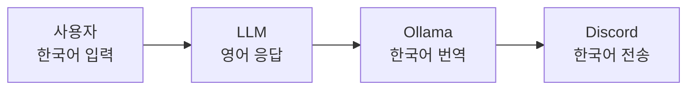

## 시작

Discord에서 돌아가는 AI 봇이 있는데, 응답에 한국어/중국어/영어가 뒤섞여서 나왔다. 기본적인 대화조차 안 되니까 이건 쓸 수가 없다.

가장 먼저 시도한 건 프롬프트 수정이었다. 시스템 프롬프트에 "항상 한국어로만 답변해라"고 명시해봤지만, 모델은 지시를 무시하고 계속 언어를 섞어서 답했다.

프롬프트로는 안 되겠다. 그러면 반대로 생각해보자.

> 모델이 영어로 답하게 하고, 그걸 번역기로 한국어로 바꾸면 되지 않을까?

이게 결국 해결책이 됐다.

## 프롬프트로 언어를 강제할 수 없다면

사용한 모델은 MiniMax M2.7이다. 다국어 모델이라서 한국어, 중국어, 영어를 모두 학습했는데, 이게 오히려 문제가 됐다. 사용자가 한국어를 쓰면 한국어로 답하다가 갑자기 중국어로 바뀌고, 다시 영어로 섞어내는 식이다.

시도한 것들:

1. **시스템 프롬프트에 "한국어만 답변" 지시 추가** — 지시를 무시함
2. **personality 설정에서 일본어 표현 유발 요소 제거** — 여전히 섞어서 나옴
3. **"항상 영어로만 답변"으로 방향 전환** — 번역 파이프라인 구성의 시작점

결론: 다국어 모델에서 특정 언어만 강제하는 건 프롬프트만으로는 한계가 있다. 후처리가 필요했다.

## 번역 모델 선택

번역은 API 호출이 필요하다. 옵션을 비교해봤다.

| 옵션 | 장점 | 단점 |
|------|------|------|
| DeepL API | 품질 최고 | 유료, 월 호출 제한 |
| Google Translate API | 무료 티어 있음 | 호출 제한, API 키 필요 |
| 로컬 번역 모델 | 완전 무료, API 키 불필요, 레이턴시 낮음 | 모델 품질에 따라 다름 |

무료로 돌리고 싶었고, API 키 관리도 하기 싫었다. 그래서 로컬에서 돌리는 걸로 결정했다. Ollama에 Google의 `translategemma:4b`를 올려서 쓰기로 했다. 4B 파라미터의 영한 번역 전용 모델이다.

## 번역 후처리 훅 구현

에이전트의 게이트웨이 코드에서 모델 응답을 가로채서 Ollama로 번역하는 훅을 추가했다. 응답이 완성된 후, 번역 API를 호출하고, 번역 결과를 원래 응답 대신 사용한다.

```python
# 에이전트 응답 직후
if config.get("translate_response") and response and response.strip():
    payload = json.dumps({
        "model": "translategemma:4b",
        "messages": [{"role": "user", "content": (
            "Translate the following text to Korean. "
            "If the text is already in Korean, return it as-is. "
            "Always use '형님' (not '형') to address the user. "
            "Output ONLY the final Korean text, nothing else:\n\n"
            + response.strip()
        )}],
        "stream": False,
    }).encode("utf-8")

    req = urllib.request.Request(
        "http://localhost:11434/api/chat",
        data=payload,
        headers={"Content-Type": "application/json"},
    )

    with urllib.request.urlopen(req, timeout=60) as tr:
        result = json.loads(tr.read().decode("utf-8"))
        translated = result.get("message", {}).get("content", "")
        if translated and translated.strip():
            response = translated.strip()
```

번역 프롬프트에 "이미 한국어면 그대로 반환"을 넣은 이유는, 모델이 가끔 한국어로 답할 때도 있기 때문이다. 그런 응답까지 무조건 번역하면 이상해질 수 있으니까.

최종 흐름은 이렇다:



## 트러블슈팅

이 과정에서 여섯 번의 문제를 만났다.

### 1. 번역 결과가 안 나온다 — 스트리밍 모드

번역 훅을 추가했는데 Discord에는 여전히 영어 응답이 그대로 나왔다.

원인은 스트리밍 모드였다. 스트리밍에서는 응답을 토큰 단위로 조금씩 전송하면서 이미 전송 완료 플래그를 세운다. 번역은 응답이 전부 완성된 후에 이루어지는데, 이미 스트리밍으로 전송이 끝난 상태라 번역 결과가 버려졌다.

해결은 스트리밍을 끄는 것이었다. 근데 이걸 찾는 데 한참 걸렸다. 설정 키가 `display.streaming`인 줄 알았는데, 게이트웨이 스트리밍을 제어하는 키는 `streaming.enabled`였다. 이름이 비슷한데 다른 키라서 헤맸다.

### 2. 번역이 스킵되고 있었다 — 임계치 로직

초기 구현에서 응답에 한국어가 30% 이상 포함되면 번역을 스킵하도록 해놨었다. "이미 한국어면 굳이 번역할 필요 없다"는 생각이었는데, 모델이 한국어/중국어/영어를 섞어서 답하니까 한국어 비율이 항상 30%를 넘어서 번역이 계속 스킵됐다.

결국 임계치 로직을 제거하고 무조건 번역기에 통과시키도록 했다. 번역 프롬프트에 "이미 한국어면 그대로 반환" 지시가 있으니, 순수 한국어 응답은 그대로 통과된다.

### 3. 모델이 지시를 안 따른다 — 메모리 충돌

"영어로만 답해라"는 시스템 프롬프트를 추가했는데도 모델이 계속 한국어로 답했다. 모델의 Reasoning 블록을 보니 이렇게 적혀 있었다:

> "The system prompt says I must respond in English only, but the user's memory says they prefer Korean. This is a conflict."

원인은 사용자 메모리 파일에 "항상 한국어로만 답변해야 함"이라는 이전 지시가 남아 있었다. 시스템 프롬프트(영어)와 메모리(한국어)가 충돌하니까 모델이 혼란스러워한 것이다.

메모리를 모두 "영어로만 답변(번역 후처리로 한국어 변환됨)"으로 수정하니 해결됐다. 시스템 프롬프트와 메모리의 지시는 항상 일관되게 유지해야 한다.

### 4. 번역이 7초나 걸린다 — CPU 연산

번역은 잘 되는데 7초씩 걸렸다. 답변 하나에 7초 추가 딜레이가 붙는 건 체감상 꽤 길다.

확인해보니 Ollama가 CPU로만 돌고 있었다.

```
NAME                 SIZE      PROCESSOR
translategemma:4b    4.2 GB    100% CPU
```

원인은 내가 리눅스(WSL)에 Ollama를 따로 설치했기 때문이다. WSL에 설치된 Ollama는 Windows의 GPU에 직접 접근할 수 없다. Windows에 이미 Ollama가 있었는데 굳이 WSL에 따로 설치한 게 실수였다.

WSL의 Ollama를 지우고 Windows Ollama를 사용하도록 변경했다. WSL에서 `localhost:11434`로 Windows Ollama에 접근할 수 있다.

### 5. Windows Ollama도 GPU를 못 쓴다

Windows Ollama로 바꿨는데도 여전히 느렸다. `nvidia-smi`를 보니 Ollama 프로세스가 GPU 메모리를 전혀 사용하지 않고 있었다. Ollama 로그를 확인해보니 VRAM이 0B로 나왔다.

```
inference compute ... type=cpu
vram-based default context total_vram="0 B"
```

원인은 Ollama 버전이었다. 내 GPU는 RTX 5060 Ti인데, 이게 최신 아키텍처라 기존 Ollama 버전이 지원하지 않았다.

Ollama를 최신 버전으로 업데이트하니 GPU가 정상 인식됐다.

```
NVIDIA GeForce RTX 5060 Ti  total="15.9 GiB"  available="14.0 GiB"
```

번역 속도가 7초에서 2.4초로 줄었다. 최신 GPU를 쓸 때는 소프트웨어 버전도 확인해야 한다.

### 6. Ollama가 계속 포트를 잡고 있다

Ollama를 재시작하려고 프로세스를 죽여도 `127.0.0.1:11434` 포트가 계속 묶여 있었다. `taskkill`로 프로세스를 죽여도 바로 다시 뜬다.

원인은 Ollama가 Windows 서비스로 등록되어 있어서 프로세스를 죽여도 자동으로 재시작되는 것이었다. 시스템 트레이의 Ollama 아이콘을 우클릭해서 Quit 해야 정상적으로 종료된다.

## 최종 결과

| 항목 | 변경 전 | 변경 후 |
|------|--------|--------|
| 응답 언어 | 한국어/중국어/영어 혼합 | 한국어만 |
| 번역 방식 | 없음 | Ollama 후처리 |
| 번역 속도 | — | 2.4초 (GPU) |
| 스트리밍 | 켜짐 | 꺼짐 |

## 교훈

1. **프롬프트로 언어를 강제하는 건 모델에 따라 안 될 수 있다.** 후처리 파이프라인을 고려하라.
2. **스트리밍 모드와 후처리는 상성이 안 좋다.** 스트리밍은 응답을 조각내서 보내니까, 완성된 후에 처리해야 하는 작업과 충돌한다.
3. **WSL에 따로 뭘 설치하기 전에 Windows에 이미 있는지 확인하라.** GPU 접근 문제가 생긴다.
4. **최신 GPU는 최신 소프트웨어가 필요하다.** RTX 5060 Ti에 구버전 Ollama는 인식하지 못했다.
5. **시스템 프롬프트와 메모리가 충돌하면 모델이 혼란스러워한다.** 모든 지시를 일관되게 유지하라.
